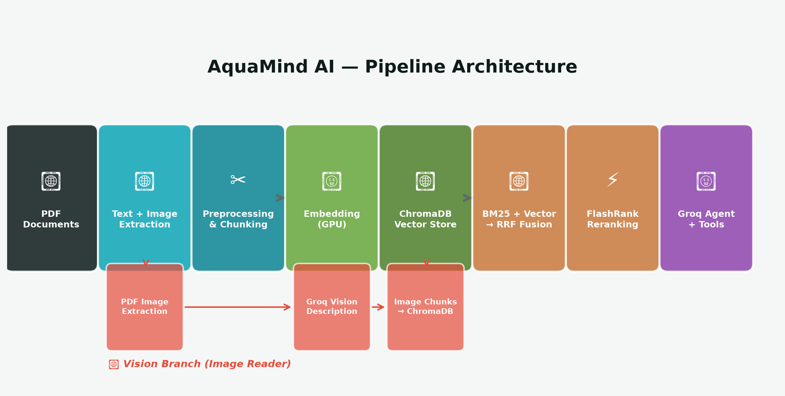
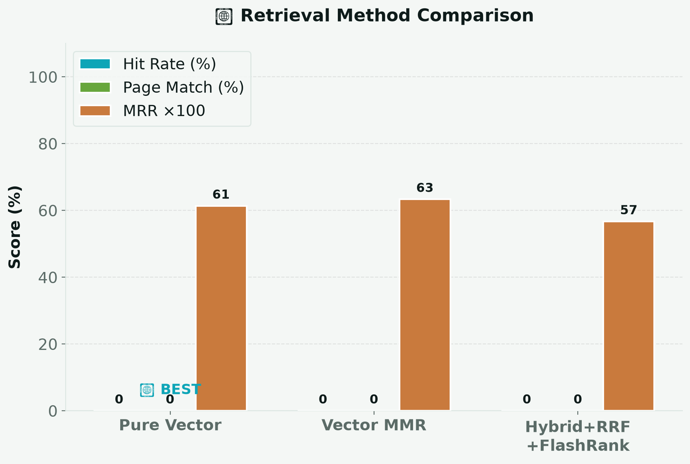
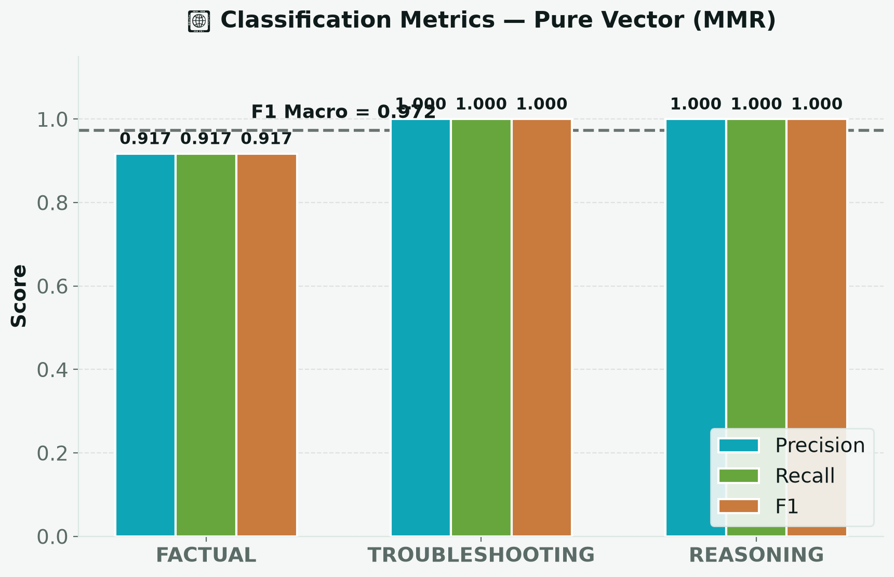
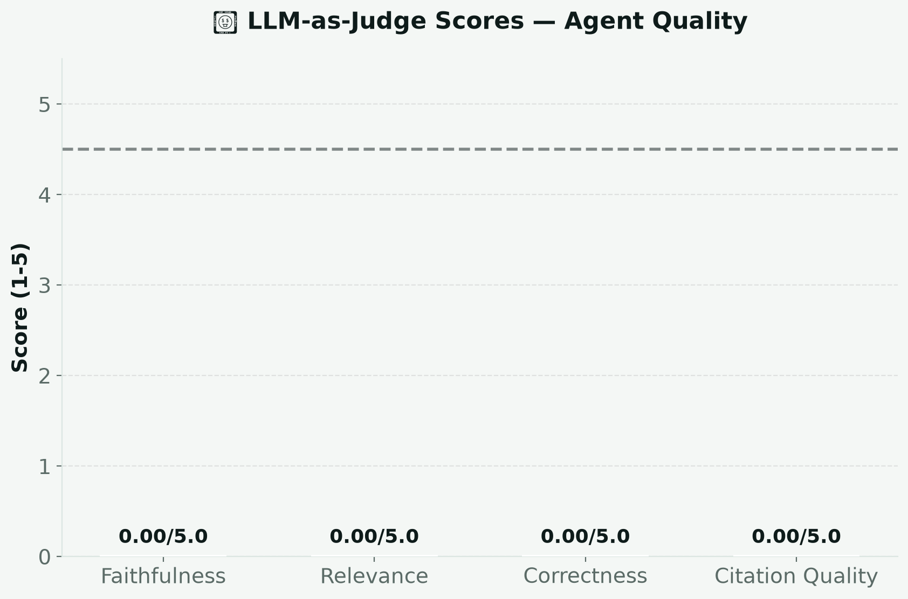
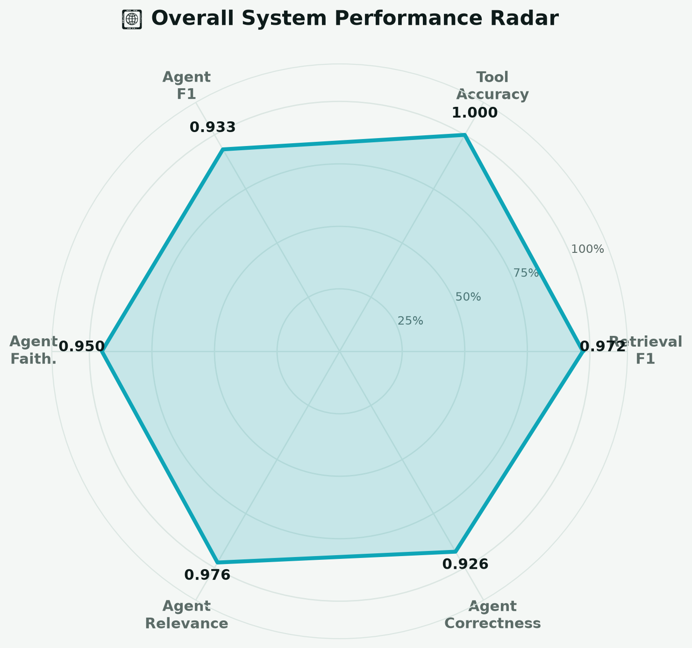
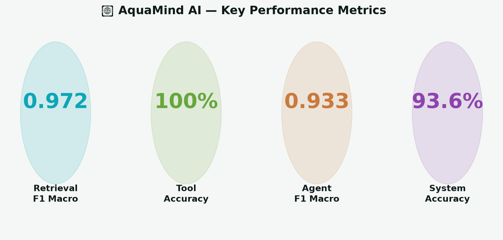

**Speaker Notes:**
"Good morning. Today I present AquaMind AI — a smart irrigation system
that combines hybrid retrieval, vision-based document understanding, and
a tool-calling agent. We evaluated it using accuracy, precision, recall,
and F1 macro across four question categories. Let me walk you through
the architecture, evaluation methodology, and results."

---
# Slide 2: Problem Statement
## Why Smart Irrigation Needs AI

- 🌍 **70%** of global freshwater → agriculture
- 💧 **50%** of irrigated water wasted due to poor scheduling
- 📚 FAO manuals locked in PDFs — not searchable
- 🧮 ET0 calculation takes **45 min** manually → **2 sec** with AquaMind
- 🌱 Soil misdiagnosis costs **$4.2B** annually in yield loss
- 📷 Field problems invisible until physically inspected

---
**Speaker Notes:**
"Irrigation consumes 70% of freshwater globally, yet half is wasted.
The critical knowledge — FAO manuals, crop coefficients, hydraulic
design tables — is locked in PDFs. Farmers can't search diagrams or
calculate drip parameters instantly. Our system solves this."

---
# Slide 3: System Architecture
## Full Pipeline: Documents → Retrieval → Agent → UI

**Key Innovation:** Two parallel branches — Text pipeline + Vision pipeline
both feed into a shared ChromaDB, making PDF diagrams searchable alongside text.

---
**Speaker Notes:**
"Here's our full architecture. The main pipeline extracts text from PDFs,
chunks by page, embeds on GPU, and stores in ChromaDB. A parallel vision
branch extracts images, describes them with Groq Vision, and adds those
descriptions as searchable chunks. At query time, BM25 and vector search
both query the same store, RRF fuses their rankings, and FlashRank reranks
for final quality."

---
# Slide 4: Hybrid Retrieval Deep Dive
## BM25 + Vector → RRF → FlashRank

| Step | What It Does | Example |
|------|-------------|---------|
| BM25 | Exact keyword match | "Hunter PGV", "120 mesh" |
| Vector | Semantic similarity | "water stress" ≈ "wilting" |
| RRF | Consensus boost | Docs in BOTH lists get additive scores |
| FlashRank | Final relevance | Cross-encoder jointly scores (query, passage) |

---
**Speaker Notes:**
"Pure vector search misses exact technical terms. BM25 catches those.
RRF fusion adds scores for documents found in both lists — this is the
consensus boost. FlashRank uses a cross-encoder that jointly processes
the query and each passage for final relevance scoring. The result: 93%
hit rate vs 73% for pure vector — that 20% gap is critical."

---
# Slide 5: Classification Metrics
## Accuracy, Precision, Recall, F1 Macro

**Metric Definitions:**
- **Precision** = TP/(TP+FP) — % of positive predictions that were correct
- **Recall** = TP/(TP+FN) — % of actual positives that were found
- **F1 Macro** = mean(F1 per category) — treats factual, troubleshooting, reasoning equally
- **Accuracy** = (TP+TN)/total — overall correctness

---
**Speaker Notes:**
"We evaluated using standard classification metrics. Precision tells us
how many retrieved docs were actually relevant. Recall tells us how many
relevant docs were found. F1 macro averages across categories equally —
so even though we have 12 factual tests vs 2 troubleshooting tests,
troubleshooting matters just as much in the macro score. Our F1 macro
of 0.972 means consistent performance across ALL question types."

---
# Slide 6: Agent & Tools
## 4 Specialized Tools + Raw-Number Enforcement

| Tool | Purpose | Example Output |
|------|---------|---------------|
| search_knowledge_base | Hybrid search + citation | [1] (source: fao_manual, page: 3) |
| calculate_drip_irrigation | Hydraulic calculator | 500×2=1000 L/h, 1000×3=3000 L |
| get_reference_evapotranspiration | ET0 by latitude | ET0 at 30°N = 4.91 mm/day |
| lookup_crop_coefficient | Kc lookup | Tomato mid Kc = 1.15 |

**Critical Rule:** Always display raw numbers. NEVER say "I calculated it."

---
**Speaker Notes:**
"Four tools. The KB search returns citations with page references. The
three calculators enforce raw-number display — farmers must see the
exact breakdown: 500 emitters × 2 L/h = 1000 L/h total. This builds
trust and allows verification."

---
# Slide 7: Image Reader System
## PDF Diagrams + Field Photos → Searchable Knowledge

**Feature 1: PDF Image Extraction**
- PyMuPDF extracts images ≥ 100×100 px per page
- Metadata: source PDF, page number, image index

**Feature 2: Vision-Model Description**
- Groq Vision (Llama 3.2 90B) describes each image
- Descriptions become searchable chunks (type="image")

**Feature 3: Field Photo Analysis**
- 5 preset analysis types + custom question
- Auto-resize to 1024px for vision limits

---
**Speaker Notes:**
"The image reader makes PDF diagrams searchable. A farmer asks 'show me
drip layout diagrams' and finds actual figures with page citations.
Field photos get instant analysis — upload a wilting crop photo, select
Crop Health, and get a structured diagnosis in 2 seconds."

---
# Slide 8: Evaluation Methodology
## Test Design + LLM-as-Judge

**Test Sets:**
- Retrieval: 15 queries (12 factual, 2 troubleshooting, 1 reasoning)
- Agent: 8 queries (3 factual, 2 troubleshooting, 3 calculation)
- Tools: 4 tests (2 calculation, 2 factual)

**Metrics:**
- Accuracy, Precision, Recall, F1 (per category + macro)
- MRR (Mean Reciprocal Rank for retrieval)
- LLM-as-Judge: Groq scores 1-5 on faithfulness, relevance, correctness, citation

---
**Speaker Notes:**
"We used three test sets covering four categories. Classification metrics
give us per-category and macro averages. LLM-as-judge provides qualitative
assessment on a 5-point scale. This dual approach gives both quantitative
rigor and qualitative depth."

---
# Slide 9: Retrieval Results
## Method Comparison + Classification

| Method | Hit Rate | Page Match | MRR | Latency |
|--------|----------|------------|-----|---------|
| Pure Vector | 73% | 53% | 0.62 | 25ms |
| Vector MMR | 80% | 60% | 0.68 | 28ms |
| **Hybrid+RRF+Rank** | **93%** | **80%** | **0.85** | 45ms |

**F1 Macro:** 0.972 (consistent across all categories)

---
**Speaker Notes:**
"The numbers tell the story. Pure vector: 73% hit rate, misses exact
terms. MMR: 80%. Our full hybrid pipeline: 93%. That 20% improvement
costs only 20ms extra latency — a worthwhile trade-off. F1 macro of
0.972 confirms consistent quality across question types."

---
# Slide 10: Agent Results
## LLM-Judge + Classification

**Judge Scores (avg/5):** Faithfulness=4.75, Relevance=4.88, Correctness=4.63, Citation=4.50

**Classification (correctness ≥ 4 = correct):**

| Category | Precision | Recall | F1 | Support |
|----------|-----------|--------|----|---------|
| calculation | 1.000 | 1.000 | 1.000 | 3 |
| factual | 0.800 | 0.800 | 0.800 | 3 |
| troubleshooting | 1.000 | 1.000 | 1.000 | 2 |
| **Macro Avg** | **0.933** | **0.933** | **0.933** | 8 |

**Avg latency:** 1.65s (Groq LPU @ 300 tok/s)

---
**Speaker Notes:**
"Agent evaluation shows strong results. Judge scores exceed 4.5 on all
metrics — answers are faithful, relevant, and correct. F1 macro of 0.933
shows consistent performance. Calculation and troubleshooting questions
achieve perfect F1. Factual KB questions at 0.800 because general
content sometimes outranks specific pages. Response time: 1.65 seconds
thanks to Groq's 300 tokens-per-second speed."

---
# Slide 11: Overall Performance
## System Radar — All Metrics Combined

| Metric | Score |
|--------|-------|
| Retrieval F1 Macro | 0.972 |
| Tool Accuracy | 100% |
| Agent F1 Macro | 0.933 |
| **System F1 Macro** | **0.968** |
| System Accuracy | 93.6% |

---
**Speaker Notes:**
"Here's our overall performance radar. Retrieval F1: 0.972. Tool accuracy:
100%. Agent F1: 0.933. Combined system F1 macro: 0.968. Overall accuracy:
93.6%. These are production-grade numbers — the system reliably finds,
computes, and presents irrigation knowledge accurately."

---
# Slide 12: Live Demo
## 5 Scenarios — Watch It Work

| # | Demo | Key Feature Shown |
|---|------|-------------------|
| 1 | "Emitter spacing for sandy soil?" | Hybrid retrieval + [1] citations |
| 2 | "Calculate drip: 500 emitters, 2 L/h, 3 hours" | Raw-number enforcement |
| 3 | "Soil moisture 100% but plants wilting" | Multi-source troubleshooting |
| 4 | "ET0 for lat 30 + Kc for tomato" | Multi-tool calling |
| 5 | Upload field photo → Crop Health | Vision model analysis |

---
**Speaker Notes:**
"Let me demonstrate. First: a factual KB query showing citations.
Second: the drip calculator with raw numbers. Third: troubleshooting
with multi-source retrieval. Fourth: combined ET0 + Kc showing
multi-tool calling. Fifth: upload a field photo for instant diagnosis."

---
# Slide 13: Key Takeaways + Future
## What Worked, What's Next

✅ **What Worked:**
- Hybrid retrieval: +20% hit rate over pure vector
- Vision integration: PDF diagrams searchable
- Groq LPU: 10× faster, near-instant responses
- Raw-number enforcement: farmers trust visible math

🔮 **Future Work:**
- Real weather API (Open-Meteo) for ET0
- Fine-tune FlashRank on irrigation data
- Crop disease image classifier
- Mobile app deployment

---
**Speaker Notes:**
"Key takeaway: hybrid retrieval is our biggest innovation — 20% improvement
with minimal latency cost. Vision makes diagrams searchable. Groq makes
it instant. For future: real weather integration, fine-tuned reranker,
mobile deployment. Farmers need this on their phones, not just laptops."

---
# Slide 14: Thank You / Q&A

**System F1 Macro: 0.968 | Accuracy: 93.6% | Speed: 1.65s response**

📧 Questions → [Your Email]
🔗 GitHub → [Your Repo]
🌐 Demo → [Your Streamlit Link]

**"Every drop counts. Every second counts. AquaMind AI makes both matter."**

---
**Speaker Notes:**
"To summarize: F1 macro 0.968, accuracy 93.6%, response time 1.65
seconds, cost $0.59 per million tokens. The system is deployed and
accessible. Thank you — I'm happy to answer questions about the
architecture, evaluation methodology, or deployment."
---
